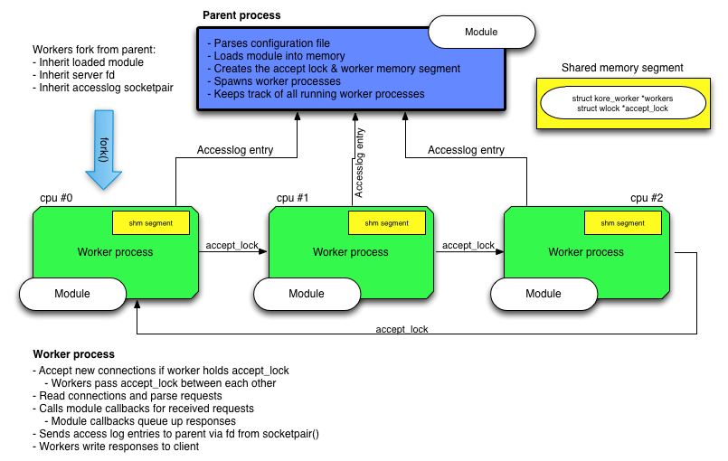

# Kore web framework

Kore is an easy to use web platform for writing scalable web APIs in C and Python.
Its primary goals are security, scalability and allowing rapid development and deployment of such APIs.

Because of this Kore is an ideal candidate for building robust, scalable and secure web things.

This documentation is for the 3.3.0 release.

# Features

* Supports SNI.
* Supports HTTP/1.1.
* Websocket support.
* TLS enabled by default.
* Optional background tasks.
* Built-in parameter validation.
* Fully privilege separated by default.
* Optional asynchronous PostgreSQL support.
* Private keys isolated in separate process \(RSA and ECDSA\).
* Default sane TLS ciphersuites \(PFS in all major browsers\).
* Modules can be reloaded on-the-fly, even while serving content.
* Optional support for page handlers in Python with async/await support.
* Event driven \(epoll/kqueue\) architecture with per CPU worker processes.
* Build your web application as a precompiled dynamic library or single binary.

# Architecture overview

